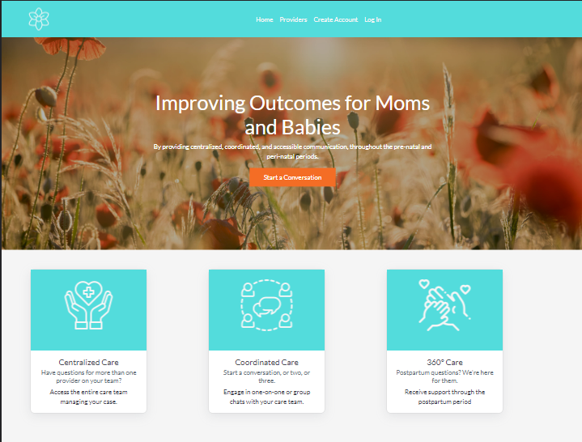
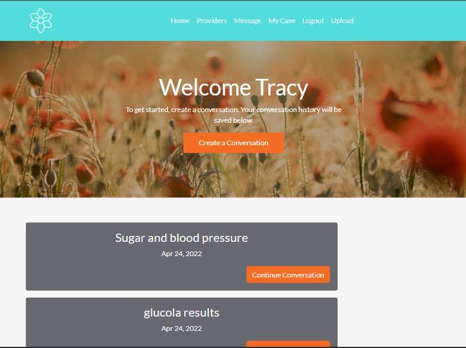
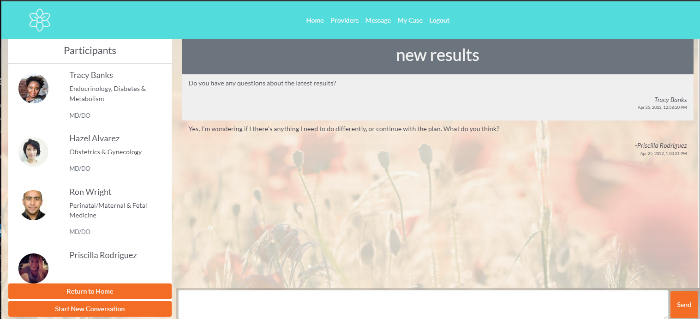
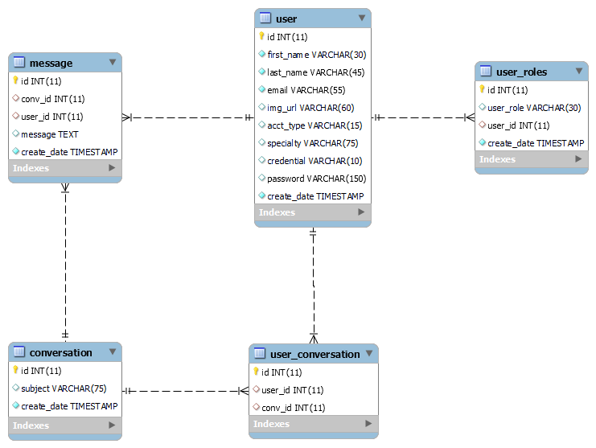

# Medical Home Chat Application: Jessie's Place

A group-chat application for use in a Medical Home EMR, or other case management system, designed to assist in the management of high-risk pregnancies.

## Description
Full stack Java application, utilizing an SQL database and Spring Boot for the backend and Bootstrap

## Table of Contents
- [Features](#Features)
- [Database](#Database)
- [Technologies](#Technologies/Resources)
- [Future Development](#Future-Develompent)
- [License](#License)

[Back to Table of Contents](#table-of-contents)
## Features
* Custom validation of user emails at the time of registration.
* All users can create conversations with one or more users.
  * message history is stored by the conversation with the user information
* User-conversations load into the users home-page upon login, and are readily accessible.

Landing Page:

Home Page:

Chat View:

[Back to Table of Contents](#table-of-contents)
## Database
ERD Diagram of database:

## Technologies/Resources
* [SQL](https://www.techonthenet.com/sql/index.php) 
* [Spring Boot](https://spring.io/projects/spring-boot)
* [Spring Data](https://spring.io/projects/spring-data)
* [Spring Security](https://spring.io/projects/spring-security)
  * [bcrypt password hashing](https://www.baeldung.com/spring-security-registration-password-encoding-bcrypt)
* [Maven](https://maven.apache.org/)
* [JUnit](https://junit.org/junit5/)
* [Bootstrap](https://getbootstrap.com/docs/5.0/getting-started/introduction/)
* [RandomUser API](https://randomuser.me/)
* [Unsplash](https://unsplash.com/)
* [Coolers](https://coolors.co/)
* [FlatIcon](https://www.flaticon.com/)
* [FontAwesome](https://fontawesome.com/icons)

[Back to Table of Contents](#table-of-contents)

## Future Development

* Add file-upload functionality, so users can add a profile photos.
* Add update-profile functionality, so users can update their information.
* Add search functionality to the conversation history page.
* 100% unit test coverage.

[Back to Table of Contents](#table-of-contents)

## Questions

Questions? You can reach me by email at jennifer.nelson242@gmail.com. Feel free to check out additional projects at [my GitHub profile](https://github.com/jnel-221).

[Back to Table of Contents](#table-of-contents)

## License 

This project is licensed under the terms of the [MIT](./LICENSE) license.

[Back to Table of Contents](#table-of-contents)
© 2022 GitHub, Inc.
Terms
Privacy
Security
Status
Docs
